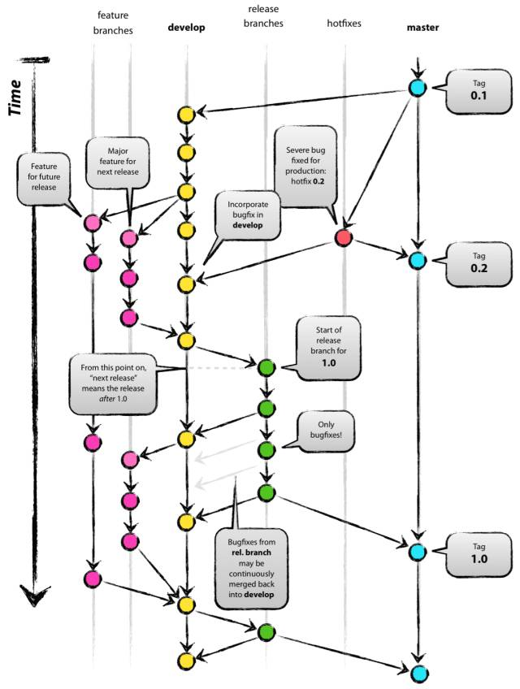
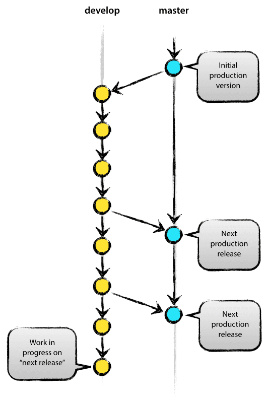
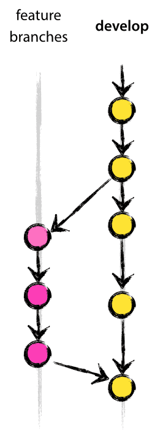
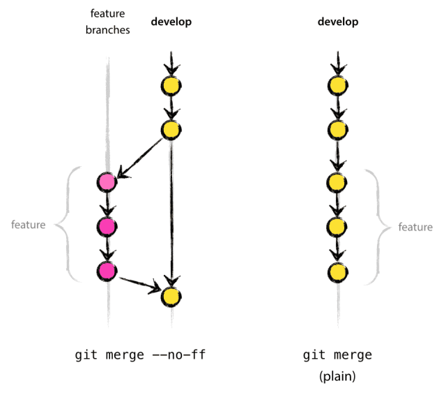
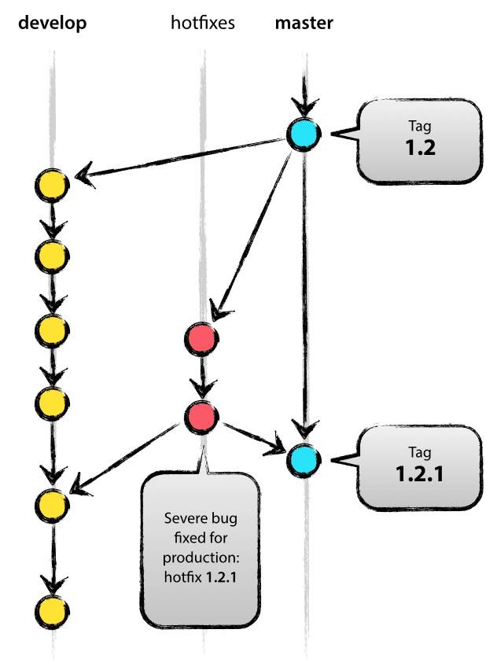

# git

[TOC]

## 一、git介绍

Git是目前世界上最先进的分布式版本控制系统。

### 1.版本管理演变过程

​	a）VCS以前用目录区分不同的版本，公共文件容易被覆盖，人员沟通成本高，代码集成效率低。

​	b）集中式VCS，需要有集中的版本管理服务器，具备文件版本管理和分支管理能力，集成效果明显提高，缺点是客户端需要与服务器相连。开发时先要从中央服务器获取最新版本，开发完后再推送给中央服务器。集中式版本控制系统最大的毛病就是必须联网才能工作，如果在局域网内还好，带宽够大，速度够快，可如果在互联网上，遇到网速慢的话，可能提交一个10M的文件就需要5分钟。

​	c）分布式VCS，分布式VCS没有“中央服务器”，每个人的电脑上都是一个完整的版本库，这样，工作的时候，就不需要联网了，因为版本库就在你自己的电脑上；工作完之后每个人相互推送就可以同步别人的修改了；在实际使用分布式版本控制系统的时候，其实很少在两人之间的电脑上推送版本库的修改，因为可能你们俩不在一个局域网内，两台电脑互相访问不了，也可能今天你的同事病了，他的电脑压根没有开机。因此，分布式版本控制系统通常也有一台充当“中央服务器”的电脑，但这个服务器的作用仅仅是用来方便“交换”大家的修改，没有它大家也一样干活，只是交换修改不方便而已。

### 2.集中式vs分布式

​	a）分布式VCS安全性高，每个人电脑里都有完整的版本库，某一个人的电脑坏掉了不要紧，随便从其他人那里复制一个就可以了。而集中式VCS的中央服务器要是出了问题，所有人都没法干活了。

​	b）分布式VCS脱离服务器，照样可以进行版本管理。而集中式VCS需要联网使用。

​	c）查看历史和版本比较等多数操作，都不需要访问服务器，比集中式VCS管理效率高。


## 二、git的安装

### 1.Windows安装

​	在Windows上使用Git，可以从Git官网直接[下载安装程序](https://git-scm.com/downloads)，然后按默认选项安装即可。安装完成后，在开始菜单里找到“Git”->“Git Bash”，蹦出一个类似命令行窗口的东西，就说明Git安装成功！

​	安装完git之后可以再安装git图形管理应用，如SourceTree或者TortoiseGit

### 2.MacOS安装

​	一是安装homebrew，然后通过homebrew安装Git。具体方法请参考homebrew的文档：<http://brew.sh/>。

​	二是安装xcode，xcode集成了git。

​	三是官网下载安装包进行安装。

### 3.Linux安装

​	用Linux系统上的包管理工具（RedHat/CentOS是yum，Debian/Ubuntu是apt-get）进行安装。安装命令可以从官网上查看。

### 4.安装完成验证

​	安装完成后用以下命令查看git是否安装成功

```
# git --version
git version X.XX.XX 		# 显示当前git版本号
```


## 三、git的配置

​	git安装完之后需要配置自己的信息，使用如下命令

```
# git config --global user.name 'Your Name'
# git config --global user.email 'email@example.com'

#注意，git的所有命令中，Windows系统下需要把单引号变为双引号。
```

### 1.config的三个作用域

```
# git config --local	# 只对当前仓库有效
# git config --global	# 只对当前登录用户有效
# git config --system	# 对系统所有用户都有效
# git config 			# 缺省设置相当于local
```

​	作用域的优先级local>global>system

### 2.显示config的配置  --list

```
# git config --list --local
# git config --list --global
# git config --list --system
```

### 3.清除配置  --unset

```
# git config --unset --local user.name
# git config --unset --global user.name
# git config --unset --system user.name
```


## 四、git基本命令


### 1.创建git仓库

```
# cd /xxx/xxx	# 进入需要创建版本库的目录
# git init		# 创建版本库
```

创建完成后，会生成.git目录，这是git来跟踪管理版本库的，不可以随便乱改，后面会有具体介绍。

### 2.向暂存区添加文件

```
# git add 文件名		# 将工作区的某个文件添加到暂存区
# git add -u 		  # 添加所有被tracked文件中被修改或删除的文件信息到暂存区，不处理untracked的文件
# git add -A		  # 添加所有被tracked文件中被修改或删除的文件信息到暂存区，包括untracked的文件
# git add . 		  # 将当前工作区的所有文件都加入暂存区
# git add -i 		  # 进入交互界面模式，按需添加文件到缓存区
```

### 3.将暂存区文件提交到本地仓库

```
# git commit -m '提交说明' 		# 将暂存区内容提交到本地仓库
# git commit -am '提交说明' 	# 跳过缓存区操作，直接把工作区内容提交到本地仓库 
```

​	这里明确一下，所有的版本控制系统，其实只能跟踪文本文件的改动，比如TXT文件，网页，所有的程序代码等等，Git也不例外。版本控制系统可以告诉你每次的改动，比如在第5行加了一个单词“Linux”，在第8行删了一个单词“Windows”。而图片、视频这些二进制文件，虽然也能由版本控制系统管理，但没法跟踪文件的变化，只能把二进制文件每次改动串起来，也就是只知道图片从100KB改成了120KB，但到底改了什么，版本控制系统不知道，也没法知道。

### 4.查看仓库当前状态

```
# git status
```

### 5.查看历史记录

```
# git log 						# 查看当前分支的记录
# git log --all					# 查看所有分支的记录
# git log -nX 		   	   	  	# X为数字表示次数，查看最近多少次的提交记录
# git log --oneline 			# 让提交记录以精简的一行输出
# git log –graph –all --online  # 图形展示分支的合并历史
# git log --stat 	 			# 简略显示每次提交的内容更改
# git log --name-only 			# 仅显示已修改的文件清单
# git log --name-status 		# 显示新增，修改，删除的文件清单
# git log --author=author  	    # 查询作者的提交记录(和grep同时使用要加一个--all--match参数)
# git log --grep=过滤信息 		 # 列出提交信息中包含过滤信息的提交记录
# git log -S查询内容 			 # 和--grep类似，S和查询内容间没有空格
# git log fileName 				# 查看某文件的修改记录，找背锅专用
```

### 6.暂存区回滚到HEAD

```
git reset HEAD^     # 恢复成上次提交的版本
git reset HEAD^^    # 恢复成上上次提交的版本，就是多个^，以此类推
git reset HEAD~n	# n代表次数，恢复成前面n个提交版本
git reflog			# 查看命令历史，以便确定要回到未来的哪个版本。
git reset --hard 版本号		# 会丢失回退之后的修改，该命令慎用
	--soft：只是改变HEAD指针指向，缓存区和工作区不变；
	--mixed：修改HEAD指针指向，暂存区内容丢失，工作区不变；
	--hard：修改HEAD指针指向，暂存区内容丢失，工作区恢复以前状态；
```

### 7.工作区回滚到暂存区

```
# git checkout -- 文件名		# 用版本库里的版本替换工作区的版本，无论工作区是修改还是删除，都可以还原
```

### 8.同步到远程仓库

```
# git push		# 简单将当前分支同步到远程仓库
# git push -u origin master		# 第一次推送加上-u参数，Git不但会把本地的master分支内容推送的远程新的master分支，还会把本地的master分支和远程的master分支关联起来，在以后的推送或者拉取时就可以简化命令。
```

### 9.从远程仓库克隆项目到本地

```
# git clone {URL}
```

### 10.同步远程仓库更新

```
# git fetch  origin master
从远程获取最新的到本地，首先从远程的origin的master主分支下载最新的版本到origin/master分支上，然后比较本地的master分支和origin/master分支的差别，最后进行合并。

git fetch比git pull更加安全
```

### 11.删除版本库文件

```
# git rm 文件名
```


## 五、git的分支管理

### 1.创建分支

```
# git checkout -b dev		# -b表示创建并切换分支

上面一条命令相当于下面的二条：
# git branch dev 		# 创建分支
# git checkout dev 		# 切换分支
```

### 2.查看分支

```
# git branch
-a 查看所有分支，包括远程分支
```

### 3.合并分支

```
# git merge dev		# 用于合并指定分支到当前分支
# git merge --no-ff -m "merge with no-ff" dev
# 加上--no-ff参数就可以用普通模式合并，合并后的历史有分支，能看出来曾经做过合并
```

### 4.删除分支

```
# git branch -d dev
```

​	因为创建、合并和删除分支非常快，所以Git鼓励你使用分支完成某个任务，合并后再删掉分支，这和直接在`master`分支上工作效果是一样的，但过程更安全。

### 5.解决冲突

​	在多人协作开发的时候，合并分支往往会遇到冲突的情况，这时要先进行冲突解决，再进行合并。

```
# git status		# 先查看状态，git会告诉我们哪些文件冲突了

# 打开冲突的文件进行编辑，推荐使用VSCode
# git用<<<<<<<，=======，>>>>>>>标记出不同分支的内容
# 进行手动修改合并后再次提交到仓库
```


## 六、分支管理策略

​	Git主流分支策略有三种：Git Flow、GitHub Flow、TBD。

​	Git Flow是应用最广的Git分支管理实践。

​	GitHub Flow主要应用于GitHub代码托管工具中，他是一种简化版的Git Flow策略。

​	TBD（Trunk-based development），是单主干的分支实践，在SVN 中比较流行。

### 1.Git Flow介绍

​	git 的分支整体预览图如下。



从上图可以看到主要包含下面几个分支：

- master: 主分支，主要用来版本发布。
- develop：日常开发分支，该分支正常保存了开发的最新代码。
- feature：具体的功能开发分支，只与 develop 分支交互。
- release：release 分支可以认为是 master 分支的未测试版。比如说某一期的功能全部开发完成，那么就将 develop 分支合并到 release 分支，测试没有问题并且到了发布日期就合并到 master 分支，进行发布。
- hotfix：线上 bug 修复分支。

#### 1.1主分支

​	主分支是长久分支，是所有开发活动的核心分支，包括 master 分支和 develop 分支。master 分支用来发布，HEAD 就是当前线上的运行代码。develop 分支就是我们的日常开发。使用这两个分支就具有了最简单的开发模式：develop 分支用来开发功能，开发完成并且测试没有问题则将 develop 分支的代码合并到 master 分支并发布。



​	A、master分支

​	通常，master分支只能从其它分支合并，不能在master分支直接修改。master分支上存放的是随时可供在生产环境中部署的代码（Production Ready state）。当开发活动到一定阶段，产生一份新的可供部署的代码时，master分支上的代码会被更新。同时，每一次更新，最好添加对应的版本号标签（TAG）。
所有在Master分支上的Commit应该打Tag。	

​	B、develop 分支

​	1）develop分支是保持当前开发最新成果的分支，一般会在此分支上进行晚间构建(Nightly Build)并执行自动化测试。

​	2）develop分支产生于master分支, 并长期存在。

​	3）当一个版本功能开发完毕且通过测试功能稳定时，就会合并到master分支上，并打好带有相应版本号的tag。

​	4）develop分支是主开发分支，包含所有要发布到下一个Release的代码，主要合并其它分支，比如Feature分支。

#### 1.2辅助分支

​	主要的辅助分支为feature分支、release分支和hotfix分支。通过这些分支，我们可以做到：团队成员之间并行开发，feature track 更加容易，开发和发布并行以及线上问题修复。

##### 1.2.1Feature分支

​	feature 分支用来开发具体的功能，一般 fork 自 develop 分支，最终可能会合并到 develop 分支。比如我们要在下一个版本增加功能1、功能2、功能3。那么我们就可以起三个feature 分支：feature1，feature2，feature3。（feature 分支命名最好能够自解释，这并不是一种好的命名。）随着我们开发，功能1和功能2都被完成了，而功能3因为某些原因完成不了，那么最终 feature1 和 feature2 分支将被合并到 develop 分支，而 feature3 分支将被干掉。



以下是操作实例：

​	从 develop 分支建一个 feature 分支，并切换到 feature 分支

```
# git checkout -b myfeature develop
Switched to a new branch "myfeature"
```

​	合并feature 分支到 develop

```
# git checkout develop
Switched to branch 'develop'
# git merge --no-ff myfeature
Updating ea1b82a..05e9557
(Summary of changes)
# git branch -d myfeature
Deleted branch myfeature
# git push origin develop
```

上面 merge 分支的时候使用了参数 --no-ff，ff 是fast-forward 的意思，--no-ff就是禁用fast-forward。关于这两种模式的区别如下图。（可以使用 sourceTree 或者命令git log --graph查看。



看了上面的图，那么使用非fast-forward模式来 merge 的好处就不言而喻了：我们知道哪些 commit 是某些 feature 相关的。虽然 git merge 的时候会自动判断是否使用fast-farward模式，但是有时候为了更明确，我们还是要加参数--no-ff或者--ff。

##### 1.2.2Release分支

​	release 分支是 pre-master。release 分支从 develop 分支 fork 出来，最终会合并到 develop 分支和 master 分支。合并到 master 分支上就是可以发布的代码了。release分支上修改的代码需要再合并到develop分支上。

​	最初所有的开发工作都在 develop 分支上进行，当这一期的功能开发完毕的时候，基于 develop 分支开一个新的 release 分支。这个时候就可以对 release 分支做统一的测试了，另外做一些发布准备工作：比如版本号之类的。

​	如果测试工作或者发布准备工作和具体的开发工作由不同人来做，比如国内的 RD 和 QA，这个 RD 就可以继续基于 develop 分支继续开发了。再或者说公司对于发布有严格的时间控制，开发工作提前并且完美的完成了，这个时候我们就可以在 develop 分支上继续我们下一期的开发了。同时如果测试有问题的话，我们将直接在 release 分支上修改，然后将修改合并到 develop 分支上。待所有的测试和准备工作做完之后，我们就可以将 release 分支合并到 master 分支上，并进行发布了。

以下是操作实例：

​	新建 release 分支

```
# git checkout -b release-1.2 develop
Switched to a new branch "release-1.2"
# ./bump-version.sh 1.2
File modified successfully, version bumped to 1.2.
# git commit -a -m "Bumped version number to 1.2"
[release-1.2 74d9424] Bumped version number to 1.2
1 files changed, 1 insertions(+), 1 deletions(-)
```

​	release 分支合并到 master 分支

```
# git checkout master
Switched to branch 'master'
# git merge --no-ff release-1.2
Merge made by recursive.
(Summary of changes)
# git tag -a 1.2
```

​	release 分支合并到 develop 分支

```
# git checkout develop
Switched to branch 'develop'
# git merge --no-ff release-1.2
Merge made by recursive.
(Summary of changes)
```

​	最后，删除 release 分支

```
# git branch -d release-1.2
Deleted branch release-1.2 (was ff452fe).
```

##### 1.2.3Hotfix分支

​	hotfix 分支用来修复线上 bug。当线上代码出现 bug 时，我们基于 master 分支开一个 hotfix 分支，修复 bug 之后再将 hotfix 分支合并到 master 分支并进行发布，同时 develop 分支作为最新最全的代码分支，hotfix 分支也需要合并到 develop 分支上去。hotfix 的好处是不打断 develop 分支正常进行。



以下是操作实例：

​	新建 hotfix 分支

```
# git checkout -b hotfix-1.2.1 master
Switched to a new branch "hotfix-1.2.1"
# ./bump-version.sh 1.2.1
Files modified successfully, version bumped to 1.2.1.
# git commit -a -m "Bumped version number to 1.2.1"
[hotfix-1.2.1 41e61bb] Bumped version number to 1.2.1
1 files changed, 1 insertions(+), 1 deletions(-)
```

​	Fix bug

```
$ git commit -m "Fixed severe production problem"
[hotfix-1.2.1 abbe5d6] Fixed severe production problem
5 files changed, 32 insertions(+), 17 deletions(-)
```

​	buf fix 之后，hotfix 合并到 master

```
# git checkout master
Switched to branch 'master'
# git merge --no-ff hotfix-1.2.1
Merge made by recursive.
(Summary of changes)
# git tag -a 1.2.1
```

​	hotfix 合并到 develop 分支

```
# git checkout develop
Switched to branch 'develop'
# git merge --no-ff hotfix-1.2.1
Merge made by recursive.
(Summary of changes)
```

​	删除 hotfix 分支

```
# git branch -d hotfix-1.2.1
Deleted branch hotfix-1.2.1 (was abbe5d6).
```


## 七、git使用技巧和注意事项（持续更新）

### 1.防止分离头指针（detached HEAD）的情况

​	分离头指针指的是我们当前的工作目录是一个没有分支的状态，在这个状态下进行提交的变更，在切换分支后，将会丢失。

​	避免分离头指针的情况只需要我们的修改跟分支进行绑定。

### 2.修改最新commit的message

```
# git commit --amend
```

### 3.修改历史commit的message（变基操作）

```
# git rebase -i 开始commit [结束commit]
# 根据提示进行操作
```

如果没有指定 结束commit,那么结束commit 默认为当前分支最新的 commit，那么rebase 结束后会自动更新当前分支指向的 commit；如果指定了结束 commit，而且结束 commit不是当前分支最新的 commit，那么rebase 后会有生成一个 游离的 head，而且当前分支指向的commit 不会更新

变基操作可以从选择的开始位置对之后的每一次提交进行修改，操作时需要谨慎，在项目中只允许对自己的分支进行该操作，对主分支不能进行该项操作。

### 4.查看变更比较

```
# git diff				# 工作区和暂存区的比较
# git diff -- 所有文件名	 # 针对文件工作区和暂存区的比较，
# git diff --catched 	# 暂存区和HEAD的比较
# git diff --staged		# 暂存区和HEAD的比较
# git diff branchA branchB -- 所有文件名			# 两个分支的文件比较
# git diff 版本号A 版本号B -- 所有文件名			# 两个版本号的文件比较
```

### 5.暂时保存工作区

```
# git stash 		# 将当前工作区进行贮藏
# git stash apply 	# 将贮藏向工作去恢复，不删除贮藏
# git stash pop		# 将贮藏向工作去恢复，删除贮藏
# git stash drop 	# 删除贮藏
```

